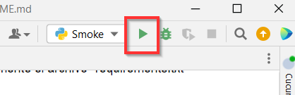
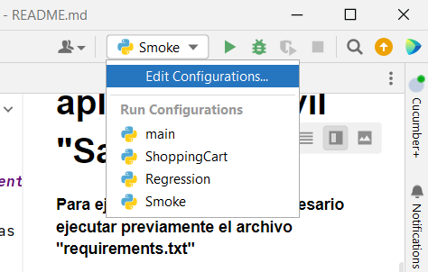
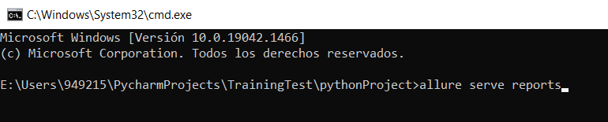

# **Proyecto que automatiza suites de pruebas de la aplicación móvil "Sauce"**

 Para ejecutar el proyecto es necesario ejecutar previamente el archivo "requirements.txt"

 Se requiere solicitar el archivo .env y agregarlo en el proyecto local para obtener las credenciales del login y así ejecutar la suite de pruebas

### Para ejecutar la suite de pruebas:

Tener conectado un dispositivo o emulador donde se realizarán las pruebas
Debe estar ejecutado el servidor de Appium
Para ejecutar todos los escenarios, en pyCharm dar clic en el botón de play, que se encuentra en la esquina superior derecha.

Si se requiere ejecutar una suite de pruebas en específico, se debe seleccionar en la lista desplegable junto al botón de play:

### Para consultar el reporte de las pruebas:

En la consola es necesario ejecutar el comando ***allure serve reports***, ubicándonos en la carpeta donde se tiene el proyecto

